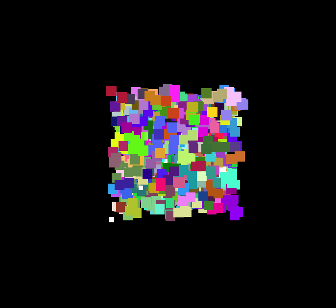

# AwkTree

AwkTree is a 3D visualization project using Three.js to display octree-structured data points with random colors in a web browser.

## Files
- `index.html`: The main HTML file.
- `main.js`: JavaScript file for initializing Three.js scene, camera, and implementing user interaction.
- `loadDataWorker.js`: A Web Worker to load the data in a separate thread.
- `colors.js`: JavaScript file that includes a function for generating random colors.
- `orbit.js`: JavaScript file that handles automatic and manual rotation of the point cloud.
<image></image>[chat](https://chat.openai.com/share/0361ca12-23f4-4c3f-a8db-d1701e27288b)

Please refer to each file for specific comments and details on their functionality.

